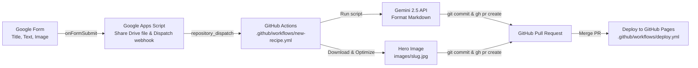

# Google Form Recipe Submission Setup

This guide explains how to set up an automated recipe submission pipeline:
1. You submit a recipe (title, free-form text, and photo) via a **Google Form**.
2. **Google Apps Script** triggers on submission and notifies GitHub via webhook.
3. **GitHub Actions** runs [`scripts/process_recipe.py`](scripts/process_recipe.py) which:
   - Uses **Gemini 2.5** to parse and format the text into the site's exact markdown format.
   - Downloads and optimizes the uploaded photo from Google Drive as a hero image (`images/<slug>.jpg`).
   - Creates a new git branch and opens a **Pull Request**.
4. You receive an email from GitHub, review the PR diff, and click **Merge** to deploy the recipe to GitHub Pages.



---

## Step 1: Create the Google Form

Create a new Google Form with the following **3 questions**:

| # | Question Title | Question Type | Settings |
|---|----------------|---------------|----------|
| 1 | **Recipe Title** | Short answer | Required |
| 2 | **Recipe** | Paragraph (Long answer) | Required. Paste ingredients, directions, notes, etc. |
| 3 | **Recipe Image** | File upload | Allow specific types: **Image**<br>Max files: **1** |

> [!NOTE]
> When you add a "File upload" question, Google Forms will create a folder in your Google Drive to store submitted photos.

---

## Step 2: Add Google Apps Script to the Form

1. In your Google Form editor, click the **three vertical dots (⋮)** in the top right corner.
2. Select **Script editor** (this opens the Google Apps Script editor).
3. Replace all existing code in `Code.gs` with the snippet below:

```javascript
// ==========================================
// CONFIGURATION
// ==========================================
const GITHUB_TOKEN = "github_pat_YOUR_TOKEN_HERE"; // Replace with your token from Step 3
const REPO_OWNER = "veducha";
const REPO_NAME = "recipes";

function onFormSubmit(e) {
  const itemResponses = e.response.getItemResponses();
  let recipeTitle = "";
  let recipeText = "";
  let imageUrl = "";

  for (let i = 0; i < itemResponses.length; i++) {
    const item = itemResponses[i];
    const questionTitle = item.getItem().getTitle().toLowerCase();
    const response = item.getResponse();

    if (questionTitle.includes("title")) {
      recipeTitle = response;
    } else if (questionTitle.includes("recipe") && !questionTitle.includes("title") && !questionTitle.includes("image")) {
      recipeText = response;
    } else if (questionTitle.includes("image") || questionTitle.includes("photo") || item.getItem().getType() === FormApp.ItemType.FILE_UPLOAD) {
      if (response) {
        // response is an array of Google Drive file IDs
        const fileId = Array.isArray(response) ? response[0] : response;
        try {
          const file = DriveApp.getFileById(fileId);
          // Make file viewable by link so GitHub Actions can download it
          file.setSharing(DriveApp.Access.ANYONE_WITH_LINK, DriveApp.Permission.VIEW);
          // Google Drive direct export URL
          imageUrl = "https://drive.google.com/uc?export=download&id=" + fileId;
        } catch (err) {
          Logger.log("Error configuring Drive file sharing: " + err);
        }
      }
    }
  }

  if (!recipeText && !recipeTitle) {
    Logger.log("No recipe details found in submission.");
    return;
  }

  // Trigger GitHub Actions workflow via repository_dispatch
  const url = `https://api.github.com/repos/${REPO_OWNER}/${REPO_NAME}/dispatches`;
  const payload = {
    event_type: "new_recipe_submission",
    client_payload: {
      recipe_title: recipeTitle,
      recipe_text: recipeText,
      image_url: imageUrl
    }
  };

  const options = {
    method: "POST",
    contentType: "application/json",
    headers: {
      "Authorization": "Bearer " + GITHUB_TOKEN,
      "Accept": "application/vnd.github+json"
    },
    payload: JSON.stringify(payload),
    muteHttpExceptions: true
  };

  const response = UrlFetchApp.fetch(url, options);
  Logger.log("GitHub Dispatch Response: " + response.getResponseCode() + " " + response.getContentText());
}
```

4. Click the **Save** icon (💾) or press `Cmd+S` / `Ctrl+S`.
5. In the left sidebar of the script editor, click **Triggers** (alarm clock icon ⏰) → **Add Trigger**:
   - **Choose which function to run**: `onFormSubmit`
   - **Choose which deployment should run**: `Head`
   - **Select event source**: `From form`
   - **Select event type**: `On form submit`
   - Click **Save**.
6. When prompted, grant the necessary Google permissions (`DriveApp` and `UrlFetchApp`).

---

## Step 3: Create a GitHub Personal Access Token (PAT)

Google Apps Script needs a token to send the webhook event to GitHub:

1. Go to [github.com/settings/tokens?type=beta](https://github.com/settings/tokens?type=beta) (Fine-grained tokens).
2. Click **Generate new token**.
3. **Token name**: `Google Forms Recipe Webhook`.
4. **Expiration**: Choose your preferred duration (e.g. 90 days, 1 year).
5. **Repository access**: Select **Only select repositories** → choose `veducha/recipes`.
6. **Repository permissions**:
   - **Contents**: `Read and write`
   - **Actions**: `Read and write`
7. Click **Generate token**.
8. Copy the token string (`github_pat_...`) and paste it into the `GITHUB_TOKEN` constant in your Google Apps Script from Step 2.

---

## Step 4: Configure GitHub Secrets & Workflow Permissions

### 1. Enable Pull Request Permissions for GitHub Actions
1. On GitHub, navigate to your repository: `veducha/recipes`.
2. Go to **Settings** → **Actions** → **General**.
3. Scroll down to **Workflow permissions**.
4. Select **Read and write permissions**.
5. Check the box: **Allow GitHub Actions to create and approve pull requests**.
6. Click **Save**.

### 2. Add your Gemini API Key
1. In your repository on GitHub, go to **Settings** → **Secrets and variables** → **Actions**.
2. Click **New repository secret**.
3. **Name**: `GEMINI_API_KEY`
4. **Value**: Your Gemini API key from [Google AI Studio](https://aistudio.google.com/).
5. Click **Add secret**.

---

## Step 5: Commit & Push Repo Files

Make sure the workflow and processing script are committed to your `master` branch:

```bash
git add scripts/process_recipe.py .github/workflows/new-recipe.yml GOOGLE_FORM_SETUP.md
git commit -m "Add Google Form recipe submission automation"
git push origin master
```

---

## Step 6: Testing & Verification

### Test Option A: Manual Test in GitHub Actions (Without Google Form)
You can test the backend pipeline directly in GitHub before using the form:
1. In your repository on GitHub, click the **Actions** tab.
2. Select the **Process New Recipe Submission** workflow on the left.
3. Click **Run workflow** (workflow_dispatch).
4. Fill in:
   - **Recipe Title**: `Test Lemon Pasta`
   - **Recipe (free-form text)**: `Boil 200g spaghetti. In a pan, heat 2 tbsp olive oil with zest of 1 lemon, 1 minced garlic clove. Toss pasta with lemon juice, parmesan, and black pepper. Serves 2 in 15 mins.`
   - **Image URL**: (leave empty or paste an image URL)
5. Click **Run workflow**.
6. Once complete, check the **Pull requests** tab. You should see a new PR ready for review!

### Test Option B: End-to-End Submission via Google Form
1. Open your Google Form preview or share link.
2. Enter a title, paste raw recipe notes, and upload a photo.
3. Click **Submit**.
4. Check GitHub:
   - Under **Actions**, the `Process New Recipe Submission` workflow will run.
   - Under **Pull requests**, a new PR will appear with `recipes/<title-slug>.md` and `images/<title-slug>.jpg`.
5. Click **Merge pull request**.
6. The `deploy.yml` workflow will automatically rebuild the index and publish the new recipe to your live site!
